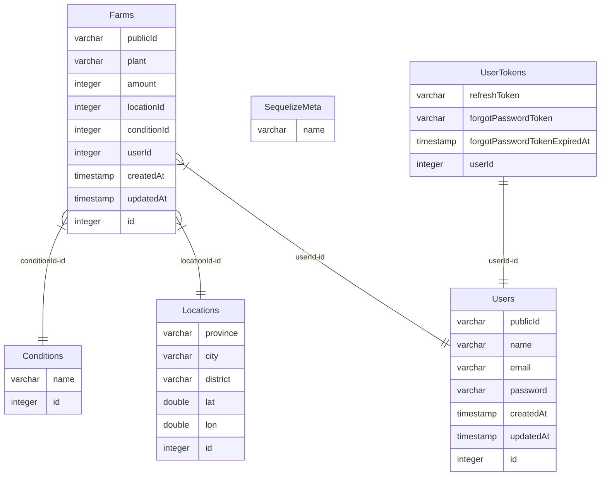
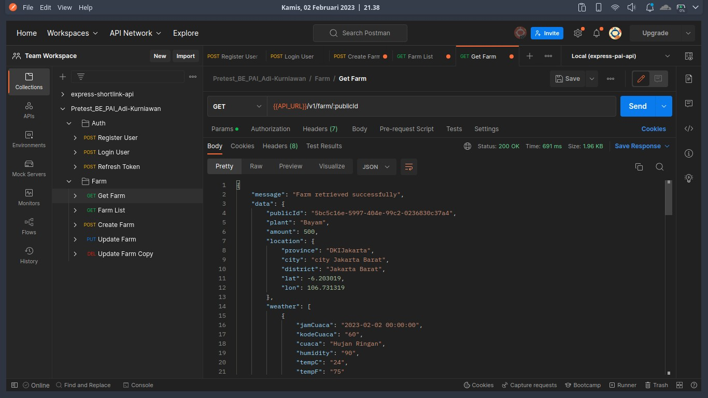
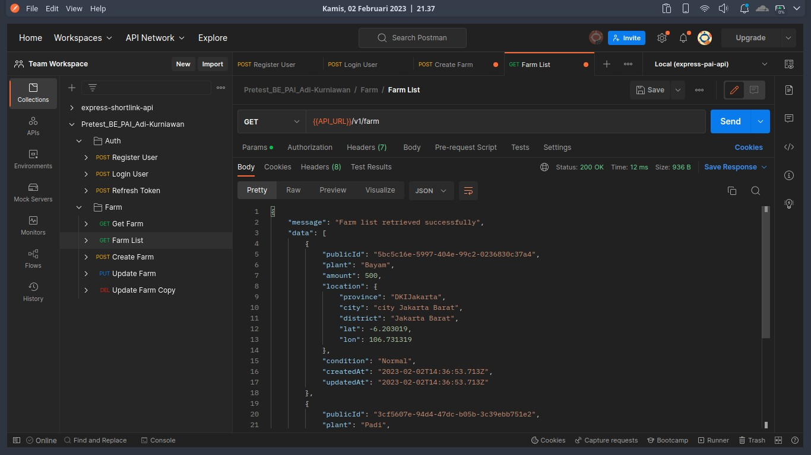
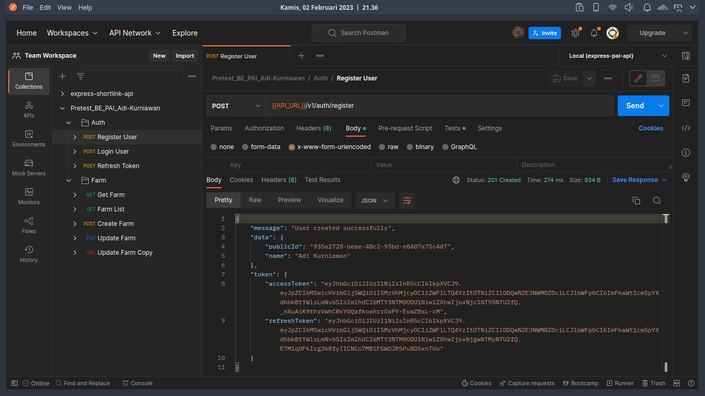

## Pretest_BE_PAI_Adi-Kurniawan

## Documentation

[](https://documenter.getpostman.com/view/13454122/2s935iumZM)

## Entity Relationship Diagram



## Run Locally

Clone the project

```bash
  git clone https://github.com/adikurniawanid/Pretest_BE_PAI_Adi-Kurniawan.git
```

Go to the project directory

```bash
  cd express-secondhand-api
```

Install dependencies

```bash
  npm install
```

Create the database

```bash
  sequelize db:create
```

Migration the database

```bash
  sequelize db:migrate
```

Seeding the database

```bash
  sequelize db:seed:all
```

Start the server

```bash
  npm start
```

## Environment Variables

To run this project, you will need to add the following environment variables to your .env file

`PORT`

`DEV_DB_USERNAME`
`DEV_DB_PASSWORD`
`DEV_DB_NAME`
`DEV_DB_HOST`

`TEST_DB_USERNAME`
`TEST_DB_PASSWORD`
`TEST_DB_NAME`
`TEST_DB_HOST`

`DATABASE_URL`

`BCRYPT_SALT`

`JWT_SECRET_KEY`
`JWT_REFRESH_SECRET_KEY`
`JWT_EXPIRATION`
`JWT_REFRESH_EXPIRATION`

## Public API

[BMKG](https://data.bmkg.go.id/)
[BMKG-IMPORTER](https://ibnux.github.io/BMKG-importer/#pakai-langsung)

## Preview

[](https://documenter.getpostman.com/view/13454122/2s935iumZM)

| {{API_URL}}/v1/farm/:publicId                      | {{API_URL}}/v1/farm                                  | {{API_URL}}/v1/auth/register                            |
| -------------------------------------------------- | ---------------------------------------------------- | ------------------------------------------------------- |
|  |  |  |

## Tech Stack

**Server:** Node, Express, PostgreSQL
